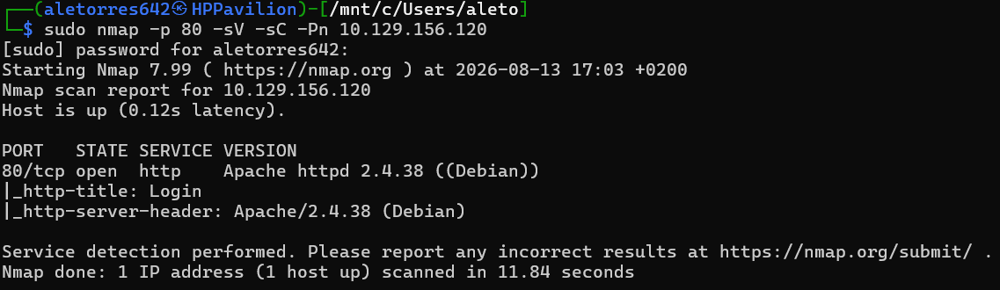
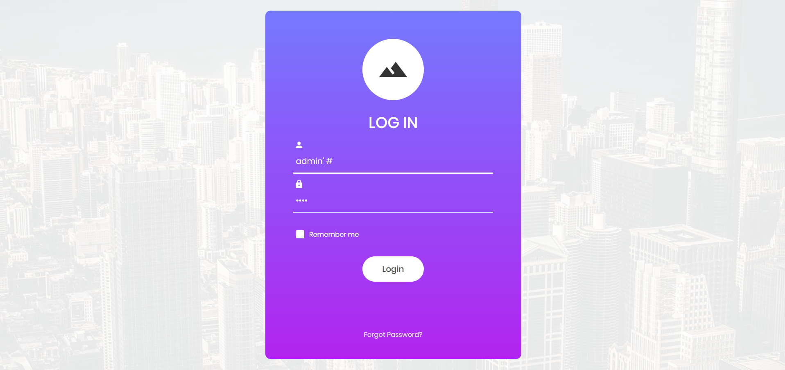
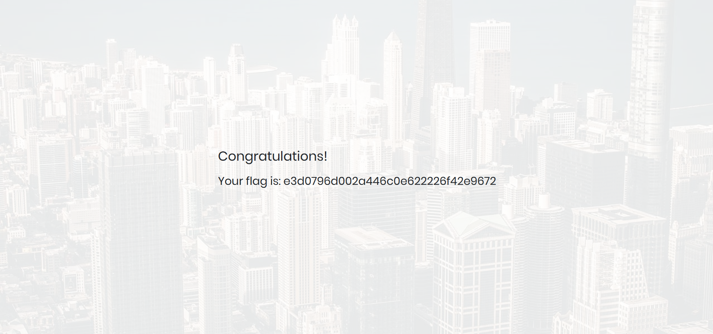

# HTB: Appointment (Starting Point)

# HackTheBox Write-up: Appointment (Starting Point - Tier 1)

**Autor:** Alejandro Torres | Ingeniero de Sistemas de Telecomunicación

**Plataforma:** HackTheBox

**Dificultad:** Very Easy

---

## 1. Reconocimiento y Enumeración

Se inició el reconocimiento lanzando un escaneo con Nmap dirigido al puerto HTTP por defecto (80), aplicando scripts básicos y detección de versiones para perfilar el servicio web.

```bash
sudo nmap -p 80 -sV -sC -Pn 10.129.156.120
```

El escaneo reveló que el puerto **80/tcp** estaba abierto, ejecutando un servidor web **Apache httpd 2.4.38**. Además, el script `http-title` de Nmap indicó que la página principal correspondía a un portal de "Login".



## 2. Explotación (SQL Injection)

Al acceder a la dirección `http://10.129.156.120` a través del navegador web, se identificó un formulario de autenticación convencional.



Se procedió a probar vulnerabilidades de inyección SQL (SQLi) en el campo del usuario. Para lograr un *Authentication Bypass*, se utilizó el payload `admin' #`. La comilla simple (`'`) sirve para cerrar la cadena de texto de la consulta SQL original del backend, mientras que la almohadilla (`#`) actúa como un carácter de comentario en MySQL, anulando el resto de la consulta (incluyendo la validación de la contraseña).

Para sortear la validación básica del lado del cliente (frontend) que impedía enviar el formulario con un campo vacío, se introdujo una cadena de texto arbitraria en el campo de la contraseña.

## 3. Extracción de la Flag

Al enviar la petición, el servidor backend procesó el payload SQL, ignoró la verificación de la contraseña falsa proporcionada y autenticó la sesión directamente como el usuario administrador.



El acceso fue exitoso, evadiendo el panel de login y revelando inmediatamente la flag que certifica el compromiso de la máquina.

---

## Anexo A: Conceptos Clave de la Máquina

Durante la resolución de esta máquina, se han introducido y consolidado los siguientes conceptos:

- **SQL Injection (SQLi):** Vulnerabilidad web crítica que permite a un atacante interferir en las consultas que una aplicación realiza a su base de datos.
- **Authentication Bypass:** Técnica para evadir los mecanismos de inicio de sesión de una aplicación o sistema sin necesidad de conocer las credenciales legítimas.
- **Validación del Lado del Cliente (Frontend):** Comprobaciones que realiza el navegador web antes de enviar los datos al servidor. No deben considerarse un mecanismo de seguridad fiable, ya que son fácilmente manipulables o evadibles.

## Anexo B: Leyenda de Comandos y Referencia Rápida

| Comando / Payload | Sintaxis de Ejemplo | Descripción y Utilidad |
| --- | --- | --- |
| **Nmap (Puerto web)** | `nmap -p 80 -sV -sC <IP>` | Escanea el puerto HTTP estándar para identificar servidores web activos y extraer información del sitio (títulos, cabeceras). |
| **Payload SQLi** | `admin' #` | Payload básico de inyección SQL. Cierra la declaración del usuario en la base de datos y comenta la lógica condicional posterior. |