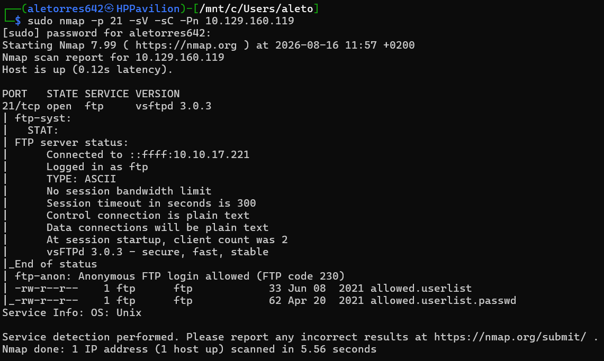
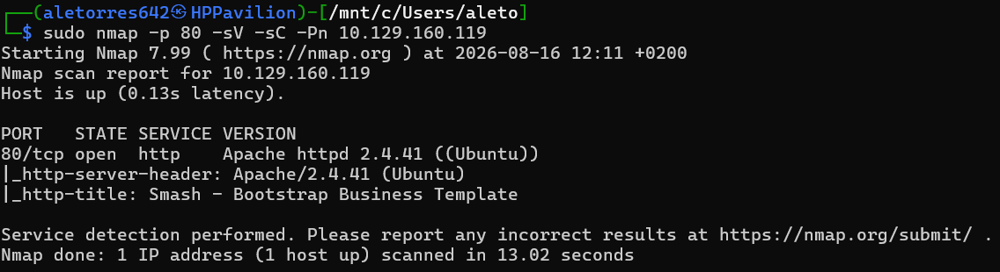
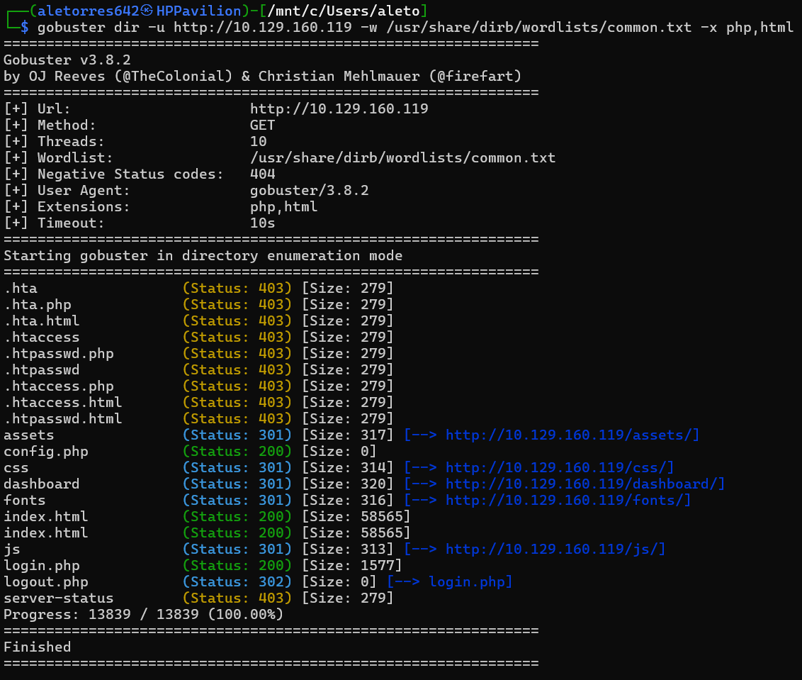
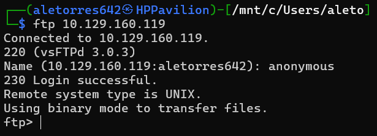
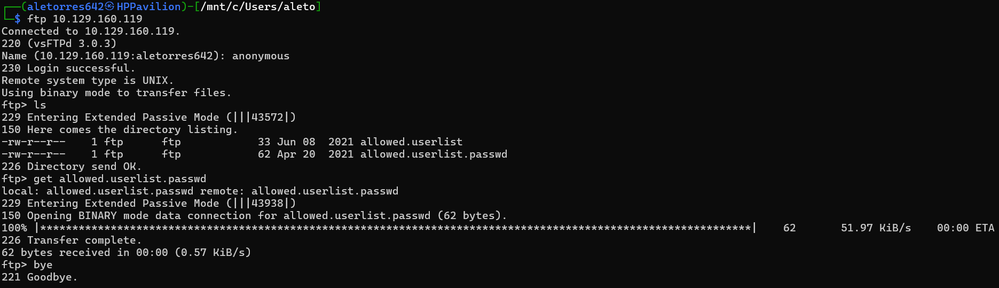
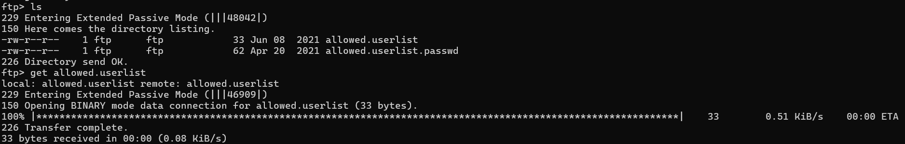
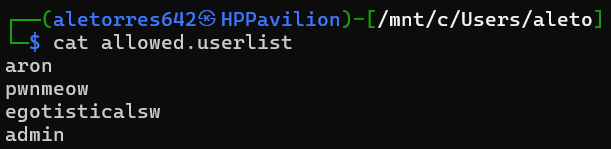
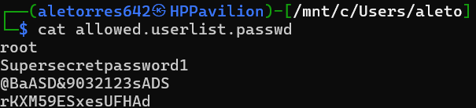
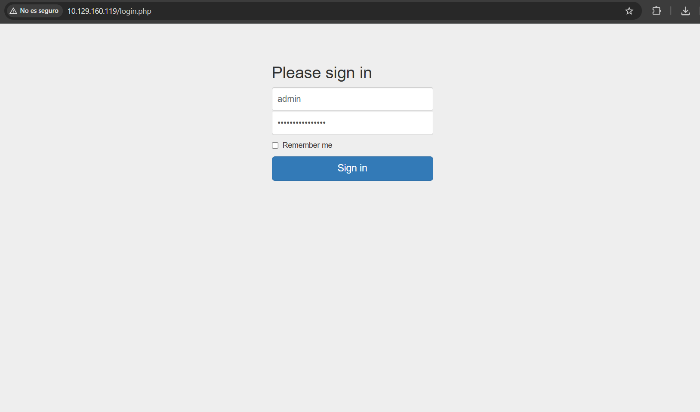
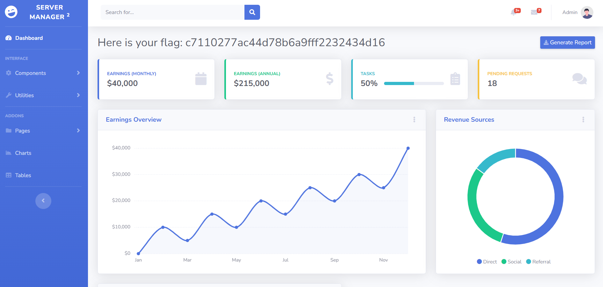

# HTB: Crocodile (Starting Point)

**Autor:** Alejandro Torres | Ingeniero de Sistemas de Telecomunicación

**Plataforma:** HackTheBox

**Dificultad:** Very Easy

---

## 1. Reconocimiento y Enumeración

Iniciamos la fase de reconocimiento analizando los servicios expuestos en la máquina objetivo. En esta ocasión, dividimos el análisis en dos vectores principales detectados: el servicio FTP y el servicio HTTP.

Comenzamos evaluando el puerto 21 (FTP). Para obtener un reporte detallado que incluya vulnerabilidades conocidas o configuraciones por defecto, añadimos a nuestro escaneo de Nmap el flag **`-sC`**, el cual emplea el uso de scripts de reconocimiento básicos de la herramienta.

```bash
sudo nmap -p 21 -sV -sC -Pn 10.129.160.119
```



Los resultados son muy reveladores: el servicio ejecutándose es **`vsftpd 3.0.3`**. Además, los scripts de Nmap nos informan que el inicio de sesión anónimo está permitido, devolviendo el código de estado FTP **`230`** (Login successful). Incluso nos lista dos archivos alojados en la raíz del servidor: `allowed.userlist` y `allowed.userlist.passwd`.

Paralelamente, escaneamos el puerto 80 para identificar la tecnología que respalda el servidor web.

```bash
sudo nmap -p 80 -sV -sC -Pn 10.129.160.119
```



Nmap nos indica que el host está ejecutando un servidor web **`Apache httpd 2.4.41`**. Al tratarse de un entorno web, procedemos a realizar una enumeración de directorios (fuzzing) utilizando **Gobuster**. Como estamos buscando archivos que nos permitan interactuar con la plataforma, utilizamos el parámetro **`-x`** para especificar que busque archivos con extensiones concretas, en este caso `php` y `html`.

```bash
gobuster dir -u http://10.129.160.119 -w /usr/share/dirb/wordlists/common.txt -x php,html
```



El resultado de Gobuster destaca el descubrimiento del archivo **`login.php`**, lo que nos confirma la existencia de un portal de autenticación. Nuestro objetivo ahora será conseguir credenciales válidas para ingresar.

## 2. Explotación (Fuga de Información vía FTP)

Sabiendo que el FTP tiene habilitado el acceso sin restricciones, procedemos a conectarnos usando la terminal. Cuando el servidor nos solicita las credenciales, introducimos el usuario **`anonymous`** y omitimos la contraseña.

```bash
ftp 10.129.160.119
```



Una vez autenticados, listamos el directorio actual (`ls`) y confirmamos la presencia de los dos archivos detectados por Nmap. Para transferirlos a nuestra máquina local y poder analizarlos, utilizamos el comando FTP **`get`**.

```bash
ftp> get allowed.userlist.passwd
```



```bash
ftp> get allowed.userlist
```



Con los archivos ya descargados en nuestro entorno, procedemos a inspeccionar su contenido usando el comando `cat`.

```bash
cat allowed.userlist
```



El archivo `allowed.userlist` contiene una lista de nombres de usuario válidos. Inmediatamente nos llama la atención un usuario que denota altos privilegios: el usuario **`admin`**. Seguidamente, inspeccionamos el archivo de contraseñas.

```bash
cat allowed.userlist.passwd
```



Obtenemos una lista de contraseñas en texto plano. Debido a que ambos archivos parecen compartir la misma estructura (línea a línea), podemos deducir que la contraseña correspondiente al usuario `admin` (ubicado en la última línea) es la última de este segundo archivo: `rKXM59ESxesUFHAd`.

## 3. Acceso Web y Extracción de la Flag

Con las credenciales administrativas en nuestro poder obtenidas gracias a la mala configuración del FTP, nos dirigimos a nuestro navegador y accedemos a la ruta que descubrimos anteriormente mediante Gobuster: `http://10.129.160.119/login.php`.



Introducimos las credenciales recolectadas (`admin` : `rKXM59ESxesUFHAd`) y el sistema nos autentica correctamente, dándonos acceso al panel de administración principal (Dashboard) del servidor "Server Manager".



Al acceder al panel, visualizamos directamente la flag en el encabezado, lo que da por concluida la intrusión y compromiso total de esta máquina.

---

## Anexo A: Conceptos Clave de la Máquina

Durante la resolución de esta máquina, se han introducido y consolidado los siguientes conceptos:

- **FTP Anonymous Login:** El File Transfer Protocol (FTP) permite configurarse para aceptar conexiones de usuarios no identificados mediante la cuenta `anonymous`. Si se habilita por error o sin las restricciones de lectura adecuadas, expone toda la estructura de directorios y archivos alojados a cualquier atacante, siendo una vía directa para la fuga de información sensible (Information Disclosure).
- **Directory Fuzzing / Fuerza Bruta de Directorios:** Técnica de reconocimiento activo en aplicaciones web que consiste en solicitar miles de rutas posibles basándose en un diccionario (wordlist) para descubrir archivos, paneles de administración ocultos o rutas no enlazadas en el código público de la web.

## Anexo B: Leyenda de Comandos y Referencia Rápida

| Comando / Herramienta | Sintaxis de Ejemplo | Descripción y Utilidad |
| --- | --- | --- |
| **Nmap (Scripts)** | `sudo nmap -p 21 -sV -sC [IP]` | `-sC` ejecuta los scripts por defecto del motor de Nmap, útiles para detectar accesos anónimos, vulnerabilidades básicas o certificados. `-sV` enumera la versión exacta del servicio. |
| **Gobuster** | `gobuster dir -u [URL] -w [wordlist] -x php,html` | Herramienta rápida escrita en Go para enumerar directorios. El flag `-x` se utiliza para añadir las extensiones que queremos probar (ej. `/ruta.php`, `/ruta.html`). |
| **FTP (Conexión)** | `ftp [IP]` | Inicia el cliente interactivo FTP en la terminal para conectarse al host objetivo por el puerto 21. |
| **FTP (Comando GET)** | `get [archivo]` | Comando interno del cliente FTP que permite descargar un archivo desde el servidor remoto a nuestra máquina local. |
| **Cat** | `cat [archivo]` | Comando de sistemas UNIX que concatena y muestra el contenido de uno o varios archivos directamente en la salida estándar de la terminal. |