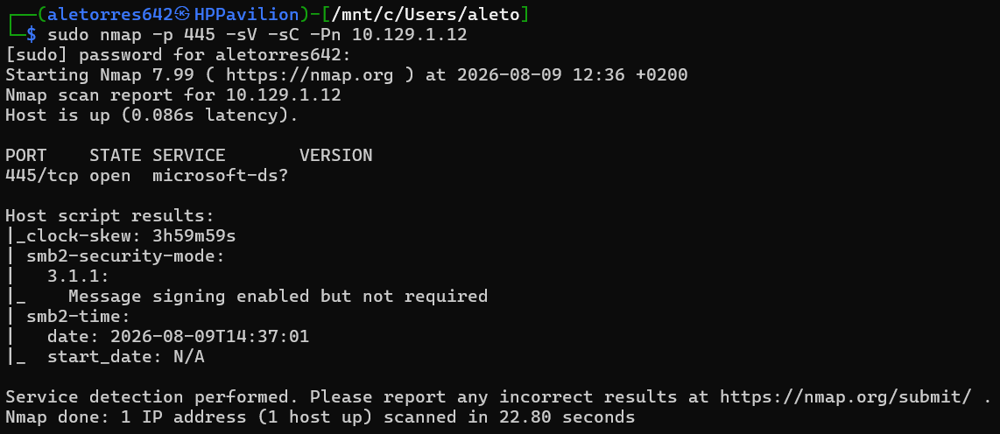
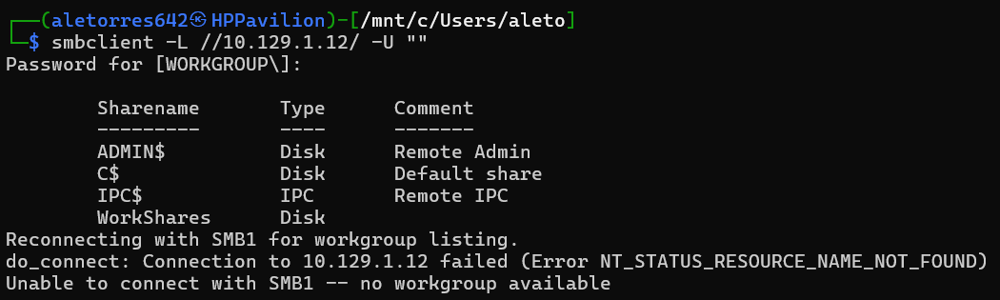
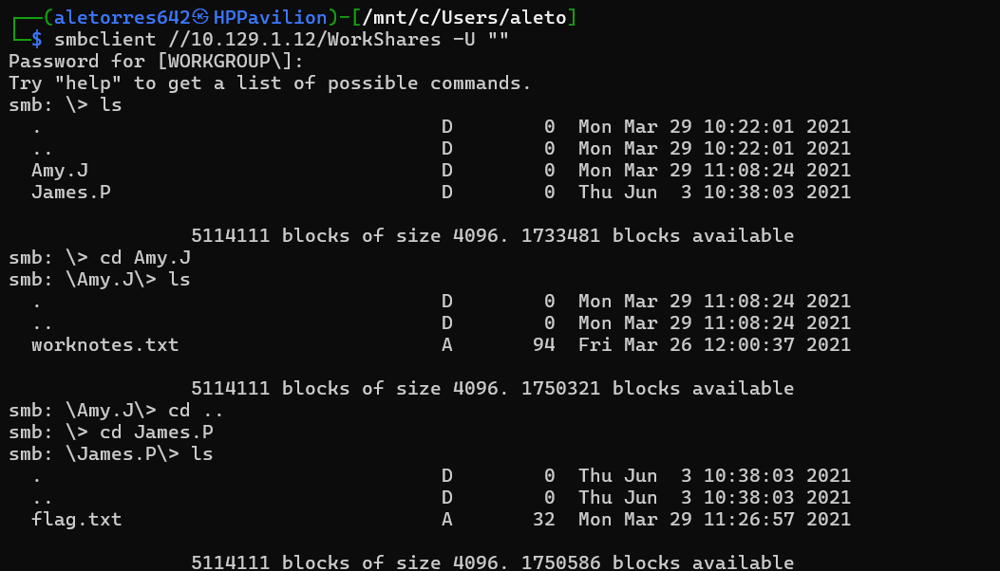
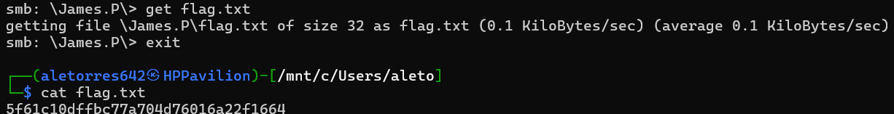

# HTB: Dancing (Starting Point)

# HackTheBox Write-up: Dancing (Starting Point - Tier 0)

**Autor:** Alejandro Torres | Ingeniero de Sistemas de Telecomunicación
**Plataforma:** HackTheBox
**Dificultad:** Very Easy

---

## 1. Reconocimiento y Enumeración

El primer paso consistió en identificar los servicios expuestos en la máquina objetivo mediante Nmap. El escaneo reveló que el puerto 445 estaba abierto. El nombre del servicio asociado a este puerto en los resultados de Nmap se identifica como `microsoft-ds`.

```bash
sudo nmap -p 445 -sV -sC -Pn 10.129.1.12
```



## 2. Explotación (Null Session en SMB)

Al tratarse del protocolo SMB (Server Message Block), se procedió a enumerar los recursos compartidos disponibles utilizando la herramienta `smbclient`. Para listar estos recursos se utilizó el flag `-L`:

```bash
smbclient -L //10.129.1.12/ -U ""
```

El comando reveló un total de 4 recursos compartidos en la máquina objetivo. De estos, el recurso al que pudimos acceder utilizando una contraseña en blanco (Null Session) fue `WorkShares`.



Nos conectamos a dicho recurso directamente:

```bash
smbclient //10.129.1.12/WorkShares -U ""
```

## 3. Extracción de la Flag

Una vez dentro del recurso, se exploraron los directorios de los usuarios `Amy.J` y `James.P`. En el directorio de Amy se encontró un archivo `worknotes.txt` de interés secundario. Tras retroceder y acceder al directorio de James, se localizó el archivo principal del reto: `flag.txt`.



Para descargar el archivo encontrado desde la shell de SMB a nuestra máquina local, se utilizó el comando `get`.

```bash
get flag.txt
```

Finalmente, tras salir del cliente SMB con el comando `exit`, se procedió a leer el contenido del archivo con `cat flag.txt` desde nuestra consola local para obtener el hash que certifica el compromiso de la máquina.



---

## Anexo A: Conceptos Clave de la Máquina

Durante la resolución de esta máquina, se han consolidado los siguientes conceptos sobre el protocolo objetivo:

- **SMB:** El acrónimo corresponde a Server Message Block. Es un protocolo de red utilizado principalmente en entornos Windows para compartir archivos, impresoras y recursos.
- **Puerto de operación:** El servicio SMB opera habitualmente a través del puerto **445**.
- **Nombre del servicio:** En las herramientas de escaneo de red como Nmap, este protocolo operando en el puerto 445 aparece bajo la denominación `microsoft-ds`.

## Anexo B: Leyenda de Comandos y Referencia Rápida

| Comando / Herramienta | Sintaxis de Ejemplo | Descripción y Utilidad |
| --- | --- | --- |
| **Listar Recursos (smbclient)** | `smbclient -L //<IP>/ -U ""` | Utiliza el switch `-L` para listar los recursos compartidos disponibles en el servidor. El parámetro `-U ""` fuerza un intento de inicio de sesión con usuario nulo o en blanco. |
| **Conexión a Recurso** | `smbclient //<IP>/<Recurso> -U ""` | Establece una conexión directa a un recurso compartido específico (por ejemplo, el recurso `WorkShares`). |
| **Descarga de Archivos** | `get flag.txt` | Comando utilizado dentro de la shell de SMB para descargar los archivos que encontremos al sistema de archivos de nuestra máquina local. |