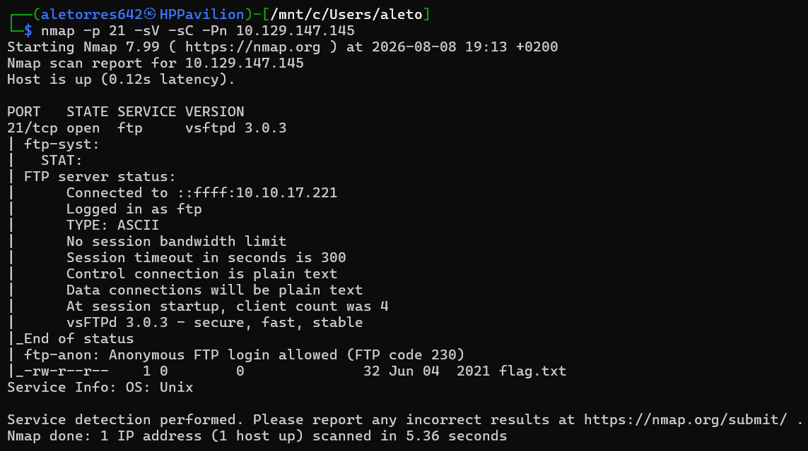
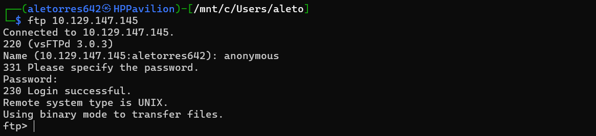
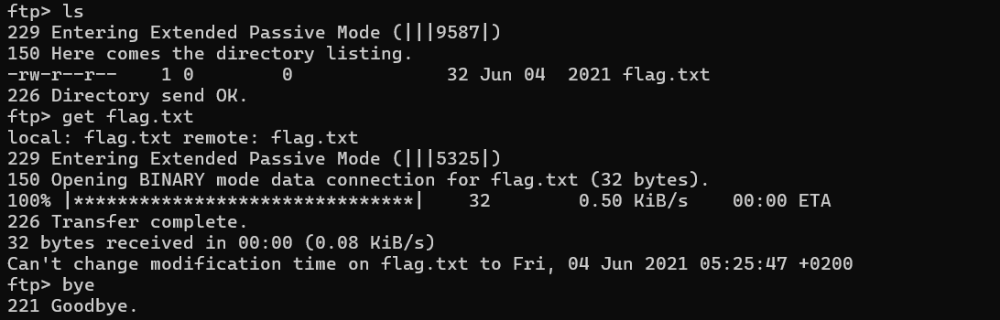
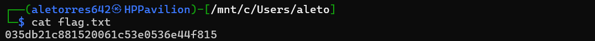

# HTB: Fawn (Starting Point)

# HackTheBox Write-up: Fawn (Starting Point - Tier 0)

**Autor:** Alejandro Torres | Ingeniero de Sistemas de Telecomunicación

**Plataforma:** HackTheBox

**Dificultad:** Very Easy

---

## 1. Reconocimiento y Enumeración

El primer paso consistió en escanear los puertos abiertos de la máquina objetivo utilizando `nmap`. Se utilizó el parámetro `-Pn` para evitar bloqueos por ping y forzar el análisis directamente sobre el puerto 21:

```bash
sudo nmap -p 21 -sV -sC -Pn 10.129.147.145
```

Los resultados revelaron que el puerto 21 estaba abierto ejecutando **vsftpd 3.0.3**. Además, los scripts de reconocimiento de Nmap confirmaron una vulnerabilidad clave: el servidor permitía el inicio de sesión anónimo (`Anonymous FTP login allowed`).



## 2. Explotación

Sabiendo que el servidor FTP estaba mal configurado, se procedió a establecer una conexión directa desde la terminal:

```bash
ftp 10.129.147.145
```

Se introdujo `anonymous` como usuario y se dejó la contraseña en blanco, logrando acceso directo al sistema de archivos del servidor.



## 3. Extracción de la Flag

Una vez dentro del servidor, se listaron los archivos del directorio actual con `ls`, identificando inmediatamente el objetivo: `flag.txt`. Se procedió a descargar el archivo a la máquina local utilizando el comando `get`:

```bash
get flag.txt
```



Finalmente, tras cerrar la conexión con el servidor usando el comando `bye`, se procedió a leer el contenido del archivo descargado en la máquina local para obtener el hash de validación que certifica el compromiso de la máquina:

```bash
cat flag.txt
```



---

## Anexo A: Conceptos Clave de la Máquina

Durante la resolución de esta máquina, se han validado los siguientes conceptos teóricos y técnicos sobre el protocolo objetivo:

- **FTP (File Transfer Protocol):** Protocolo estándar de red utilizado para la transferencia de archivos. Transmite los datos en texto plano (sin cifrar).
- **Puerto por defecto:** El servicio FTP tradicionalmente escucha en el puerto **21**.
- **SFTP:** Protocolo diseñado para ofrecer la misma funcionalidad que FTP pero de forma segura y cifrada, funcionando como una extensión del protocolo SSH.
- **Entorno detectado:** El escaneo de reconocimiento confirmó que la máquina objetivo corría sobre un sistema operativo **Unix**, ejecutando el servicio **vsftpd 3.0.3**.
- **Acceso Anónimo:** Configuración vulnerable (muy común en CTFs básicos) que permite iniciar sesión en el servidor sin tener una cuenta válida, utilizando el nombre de usuario `anonymous`.
- **Código 230:** Es el código de respuesta estándar del protocolo FTP que devuelve el servidor para indicar que el inicio de sesión ha sido exitoso (*Login successful*).

## Anexo B: Leyenda de Comandos Usados

A continuación se detallan las utilidades y comandos empleados durante las fases de reconocimiento y explotación:

- **`ping <IP>`:** Envía paquetes ICMP (*echo request*) para comprobar si hay conectividad a nivel de red con el objetivo.
- **`sudo nmap -p 21 -sV -sC -Pn <IP>`:** Ejecución de Nmap para escaneo de puertos y servicios.
    - `p 21`: Restringe el escaneo exclusivamente al puerto 21.
    - `sV`: Enumera y determina la versión exacta del servicio en ejecución.
    - `sC`: Lanza los scripts de reconocimiento por defecto (fue lo que descubrió el acceso anónimo permitido).
    - `Pn`: Omite el descubrimiento previo del host mediante ping, asumiendo que la máquina está viva (esencial para evadir bloqueos de firewall).
- **`ftp -?`:** Muestra el menú de ayuda del cliente FTP local.
- **`ftp <IP>`:** Inicia la conexión cliente-servidor contra el FTP objetivo.
- **`ls`** (o `dir`): Lista los archivos y directorios disponibles en la ubicación actual (tanto en la terminal de Linux como dentro de la sesión FTP).
- **`get <archivo>`:** Descarga el archivo especificado desde el servidor FTP remoto hasta nuestra máquina local.
- **`bye`:** Cierra de forma segura la conexión con el servidor FTP.
- **`cat <archivo>`:** Imprime por pantalla el contenido de un archivo de texto en entornos Linux/Unix.