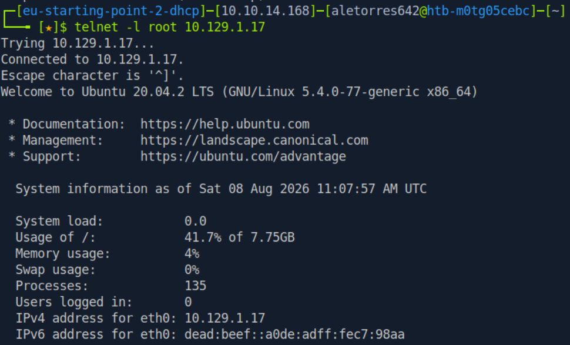
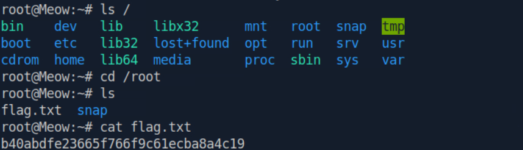

# HTB: Meow (Starting Point)

# HackTheBox Write-up: Meow (Starting Point - Tier 0)

**Autor:** Alejandro Torres | Ingeniero de Sistemas de Telecomunicación

**Plataforma:** HackTheBox

**Dificultad:** Very Easy

---

## Resumen Ejecutivo

"Meow" es una máquina de nivel inicial (Tier 0) diseñada para introducir los conceptos básicos de reconocimiento de red y conexión a servicios remotos obsoletos. El compromiso del sistema se logra al identificar un puerto Telnet expuesto y explotar una mala configuración de control de acceso (ausencia de credenciales).

## Fase 1: Reconocimiento

El primer paso en cualquier auditoría es descubrir qué puertos y servicios están expuestos en la máquina objetivo mediante el escaneo de puertos.

## Fase 2: Enumeración y Explotación

Telnet es un protocolo de red heredado que se utilizaba para acceder a interfaces de línea de comandos de forma remota.

Para interactuar con el servicio descubierto, lanzamos el comando especificando el usuario administrador directamente:

```bash
telnet -l root 10.129.1.17
```



## Fase 3: Post-Explotación (Captura de la Flag)

Con acceso de administrador en la máquina, navegamos por el sistema de archivos hasta el directorio correspondiente y leímos el contenido del archivo objetivo para extraer la *flag*.

Comandos ejecutados:

```bash
ls /
cd /root
ls
cat flag.txt
```



---

## Anexo A: Conceptos Clave de la Máquina

Durante la resolución de esta máquina de nivel inicial, se han introducido y validado los siguientes conceptos fundamentales:

- **Virtual Machine (VM):** En ciberseguridad, los entornos aislados como las máquinas objetivo o los Pwnbox suelen ser Máquinas Virtuales.
- **Terminal:** Consola o *shell* utilizada para interactuar con el sistema operativo y enviar instrucciones mediante línea de comandos.
- **OpenVPN:** Servicio de red empleado para establecer el túnel privado y conectarse de forma segura a los laboratorios de HTB.
- **Telnet:** Protocolo de red que opera por defecto en el puerto **23/tcp**. Permite el acceso remoto a consolas, pero es altamente inseguro ya que transmite la información en texto plano.
- **Mala configuración de privilegios:** El vector de entrada consistió en aprovechar que el servicio Telnet permitía el inicio de sesión con el usuario `root` y una contraseña en blanco. La flag de validación se encontraba alojada en el directorio personal (home) de este usuario.

## Anexo B: Leyenda de Comandos y Referencia Rápida

| Comando / Herramienta | Sintaxis de Ejemplo | Descripción y Utilidad |
| --- | --- | --- |
| **Ping** | `ping <IP>` | Utilidad de red que envía una solicitud de eco ICMP (*ICMP echo request*) para comprobar la conectividad contra el objetivo. |
| **Nmap** | `nmap <IP>` | Es la herramienta más común para encontrar puertos abiertos y descubrir servicios en una máquina objetivo. |
| **Telnet** | `telnet -l root <IP>` | Establece una sesión de terminal remota en texto plano. El parámetro `-l root` especifica el usuario con el que se desea autenticar directamente. |
| **Listar Archivos** | `ls /` | Muestra el contenido (archivos y directorios) de la ruta especificada. En este caso, explora el directorio raíz del sistema. |
| **Cambio de Directorio** | `cd /root` | Permite navegar y cambiar el directorio de trabajo actual dentro del sistema de archivos hacia la ruta indicada (`/root`). |
| **Visualizar Archivos** | `cat flag.txt` | Lee y muestra por pantalla el contenido completo de un archivo de texto plano directamente en la terminal. |
