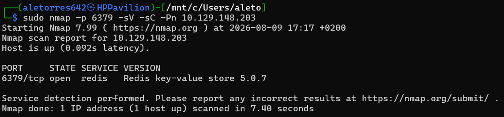
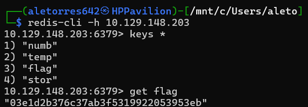

# HTB: Redemeer (Starting Point)

# HackTheBox Write-up: Redemeer (Starting Point - Tier 0)

**Autor:** Alejandro Torres | Ingeniero de Sistemas de Telecomunicación

**Plataforma:** HackTheBox

**Dificultad:** Very Easy

---

## 1. Reconocimiento y Enumeración

Para el escaneo de esta máquina, fue necesario modificar la estrategia habitual. Dado que el servicio objetivo no opera en los puertos más comunes (Top 1000), se procedió a escanear el rango completo de puertos TCP (del 1 al 65535) utilizando el parámetro `-p-` en Nmap para descubrirlo. Una vez localizado, se lanzó un escaneo dirigido con scripts básicos de reconocimiento a dicho puerto.

```bash
sudo nmap -p 6379 -sV -sC -Pn 10.129.148.203
```



El escaneo reveló que el puerto **6379/tcp** se encontraba abierto, corriendo una instancia de la base de datos en memoria **Redis** (versión 5.0.7).

## 2. Explotación (Conexión a Redis)

Al tratarse del servicio Redis, se utilizó la herramienta por línea de comandos `redis-cli` (incluida en el paquete `redis-tools` de Linux) para establecer una conexión remota con el servidor. Se verificó que el servicio estaba expuesto sin requerir autenticación.

```bash
redis-cli -h 10.129.148.203
```

Una vez establecida la sesión en el servidor (`10.129.148.203:6379>`), se procedió a solicitar la información básica del mismo mediante el comando `info`, donde se pudo corroborar la versión exacta de la instancia detectada por Nmap.

## 3. Extracción de la Flag

Sabiendo que Redis opera bajo una estructura de almacenamiento clave-valor (key-value), el primer paso consistió en enumerar todas las claves almacenadas en memoria mediante el comando `keys *`.

El servidor devolvió las siguientes llaves:

1. "numb"
2. "temp"
3. "flag"
4. "stor"

Habiendo identificado la clave de interés (`flag`), se procedió a solicitar su valor correspondiente utilizando el comando `get flag`.



El comando expuso el hash en texto plano, comprometiendo así la máquina con éxito.

---

## Anexo A: Conceptos Clave de la Máquina

Durante la resolución de esta máquina, se han introducido y consolidado los siguientes conceptos:

- **Escaneo Dirigido (Targeted Scanning):** Comprender cómo optimizar el reconocimiento lanzando escaneos de Nmap directamente a puertos específicos cuando se conoce o sospecha la existencia de un servicio concreto que opera fuera del Top 1000 por defecto.
- **Redis (Remote Dictionary Server):** Sistema de almacenamiento en memoria de código abierto utilizado como base de datos, caché y bróker de mensajes.
- **Estructura Clave-Valor:** Paradigma de almacenamiento de datos distinto a un sistema de archivos tradicional.
- **Puerto Predeterminado:** El servicio Redis opera habitualmente en el puerto **6379/tcp**.

## Anexo B: Leyenda de Comandos y Referencia Rápida

| Comando / Herramienta | Sintaxis de Ejemplo | Descripción y Utilidad |
| --- | --- | --- |
| **Nmap (Escaneo a puerto específico)** | `nmap -p 6379 <IP>` | Utiliza el flag `-p` para escanear únicamente el puerto indicado, ahorrando tiempo de ejecución frente a un escaneo completo. |
| **Cliente Redis** | `redis-cli -h <IP>` | Establece una conexión por línea de comandos hacia el servidor Redis especificado. |
| **Listar Claves (Redis)** | `keys *` | Comando interno de Redis que enumera y muestra todas las llaves (keys) almacenadas en la base de datos. |
| **Obtener Valor (Redis)** | `get <clave>` | Comando interno de Redis que devuelve el valor asociado a la clave especificada. |
