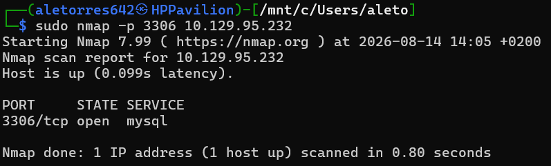
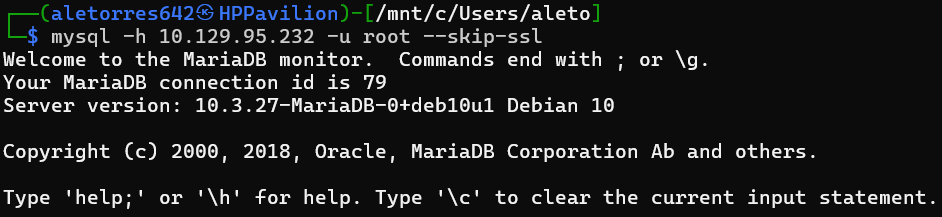
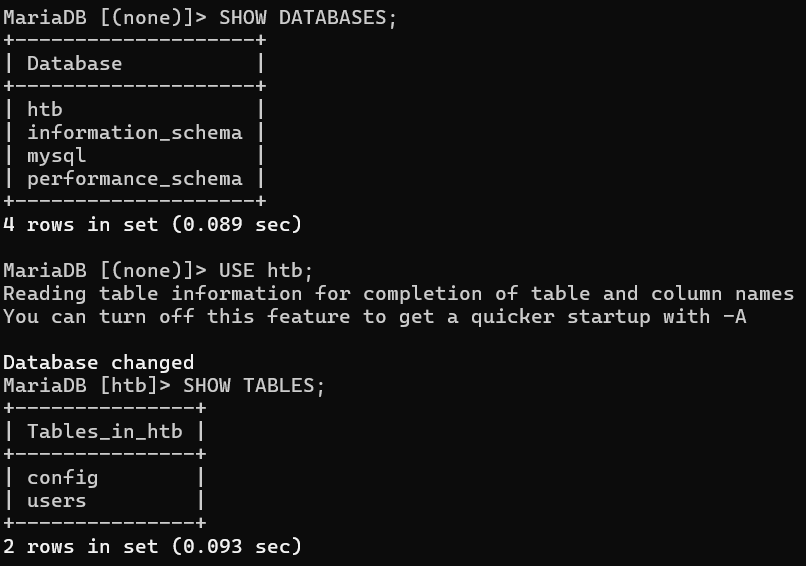
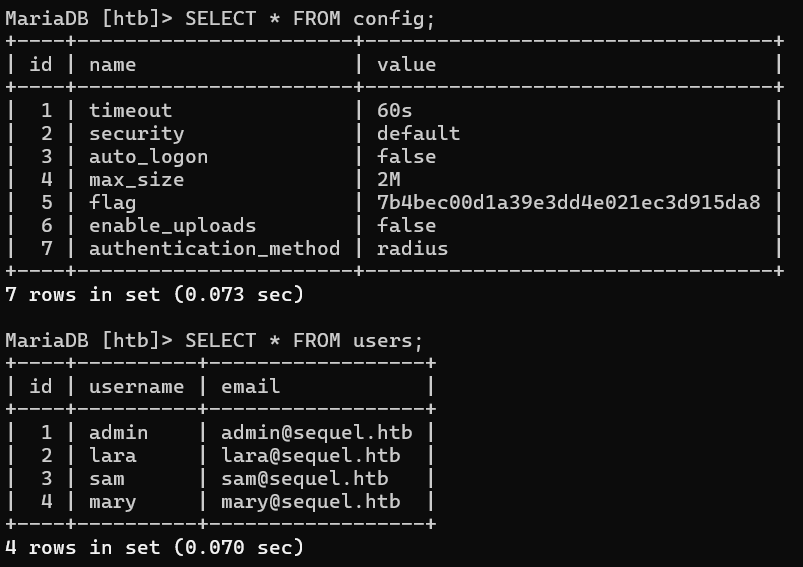

# HackTheBox Write-up: Sequel (Starting Point - Tier 1)

**Autor:** Alejandro Torres | Ingeniero de Sistemas de Telecomunicación

**Plataforma:** HackTheBox

**Dificultad:** Very Easy

---

## 1. Reconocimiento y Enumeración

El primer paso en cualquier auditoría es conocer la superficie de exposición del objetivo. Iniciamos nuestra fase de reconocimiento con un escaneo dirigido mediante la herramienta Nmap para identificar servicios activos.

```bash
sudo nmap -p 3306 10.129.95.232
```



El escaneo revela que el puerto **`3306`** se encuentra abierto. Este es el puerto estándar asociado a **MySQL**. Al profundizar en las versiones en este tipo de entornos, es habitual encontrarnos con **MariaDB**, la cual es una derivación (fork) de código abierto y desarrollada por la comunidad a partir de MySQL. Esto marca directamente nuestro vector de ataque: debemos intentar interactuar con este motor de base de datos.

## 2. Explotación (Mala Configuración de MariaDB)

Uno de los fallos más comunes en entornos en fase de desarrollo o sistemas mal administrados es dejar configuraciones por defecto, lo que incluye cuentas de administrador sin credenciales.

Procedemos a conectarnos de forma remota al servicio utilizando el cliente de MySQL por consola. Para ello, utilizamos el parámetro **`-u`** que nos permite especificar el nombre de inicio de sesión, probando suerte con el usuario administrador por excelencia: **`root`**. Adicionalmente, pasamos el flag `--skip-ssl` para evitar errores de conexión por certificados en el entorno de laboratorio.

```bash
mysql -h 10.129.95.232 -u root --skip-ssl
```



El acceso es exitoso. Se confirma que el usuario `root` permite el inicio de sesión sin necesidad de proporcionar ninguna contraseña, otorgándonos acceso directo al monitor de MariaDB con máximos privilegios. Es importante recordar que en este intérprete, por sintaxis de SQL, cada consulta que ejecutemos deberá terminar obligatoriamente con el símbolo de punto y coma (**`;`**).

## 3. Extracción de la Flag

Una vez dentro, el objetivo es enumerar la estructura de la base de datos para localizar información sensible. Primero listamos las bases de datos disponibles con `SHOW DATABASES;`. Entre las opciones por defecto del sistema, destaca una cuarta base de datos que es única para este host: **`htb`**.

Para interactuar con ella, utilizamos el comando **`use`** (concretamente `use htb;`), lo que cambia nuestro contexto de trabajo a esta base de datos. Seguidamente, ejecutamos `SHOW TABLES;` para listar su contenido.



Observamos dos tablas: `config` y `users`. Si en una auditoría real quisiéramos conocer exactamente las diferentes columnas que componen una tabla antes de volcar su contenido, podríamos utilizar el comando **`describe`** (ej. `describe config;`).

Sin embargo, para agilizar la extracción en este laboratorio, ejecutamos directamente una consulta `SELECT` utilizando el símbolo asterisco (**`*`**), el cual le indica al motor SQL que queremos mostrar absolutamente todo el contenido (todas las columnas y registros) de la tabla especificada.

```sql
SELECT * FROM config;
SELECT * FROM users;
```



Al visualizar la tabla **`config`**, detectamos inmediatamente una columna llamada `flag` que contiene el hash final de la máquina. Adicionalmente, el volcado de la tabla `users` nos muestra correos y nombres que podrían ser útiles para pivotar o realizar fuerza bruta en otros servicios en un escenario real. Con el hash en nuestro poder, la máquina queda comprometida y completada.

---

## Anexo A: Conceptos Clave de la Máquina

Durante la resolución de esta máquina, se han introducido y consolidado los siguientes conceptos:

- **Credenciales por Defecto / Autenticación Vacía:** Una vulnerabilidad crítica que ocurre cuando los administradores despliegan servicios olvidando asegurar la cuenta de superusuario (`root` o `admin`) con una contraseña robusta, permitiendo en este caso el acceso íntegro al motor de base de datos sin restricciones.
- **Enumeración SQL Básica:** El proceso de descubrir cómo está estructurada la información. Entender la sintaxis estándar (uso de `;`, selección de bases de datos con `use`, y extracción de datos con `SELECT *`) es la base técnica fundamental para interactuar con sistemas gestores de bases de datos relacionales.

## Anexo B: Leyenda de Comandos y Referencia Rápida

| Comando / Herramienta | Sintaxis de Ejemplo | Descripción y Utilidad |
| --- | --- | --- |
| **Nmap** | `sudo nmap -p 3306 [IP]` | Escanea un puerto específico (3306) en la IP objetivo para comprobar si el servicio MySQL/MariaDB está activo. |
| **Cliente MySQL** | `mysql -h [IP] -u root --skip-ssl` | Se conecta a un servidor de bases de datos remoto (`-h`), especificando el usuario de inicio de sesión (`-u`), y omitiendo la verificación de certificados SSL/TLS. |
| **Comando SQL (SHOW)** | `SHOW DATABASES;` | Lista todas las bases de datos alojadas en el servidor. |
| **Comando SQL (USE)** | `USE htb;` | Selecciona y cambia el contexto de trabajo a la base de datos especificada (`htb`). |
| **Comando SQL (DESCRIBE)** | `DESCRIBE config;` | Muestra la estructura de la tabla (nombres de las columnas, tipos de datos, etc.). |
| **Comando SQL (SELECT)** | `SELECT * FROM config;` | Extrae y muestra en pantalla absolutamente todas (`*`) las columnas y filas que componen la tabla indicada. |